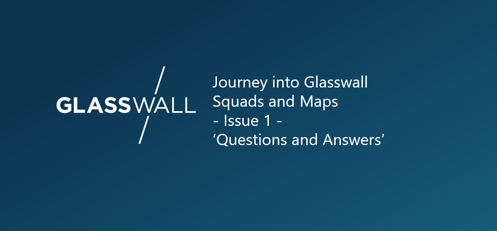

After 2 weeks of Glasswall starting to learn about and embrace the concept of squads in the work place in preparation for full adoption in the new year, a number of questions have been raised and some initial challenges discussed. I’ll be attempting to start a cadence of blogging about these to publicise our answers, conclusions, challenges, discussions and the overall journey into the world of Squads. Our implementation of Squads will be custom fit to our organisation and blend in concepts introduced by Wardley Maps, hence the blog title: Glasswall Squads and Maps.
What Glasswall challenges does it solve?
We’re hoping a lot of them! But to name a few specifics:
Ability to make decisions quickly and effectively
Removes communication breakdown
Puts the engineers in direct engagement with the customers
Higher alignment across the organisation
Happier employees through empowerment and happier customers through engagement
Quick and consistent delivery cadence
What is the impact on current teams workload and backlog?
After a long year and a lot of hard work we have been winding down and only pushing out the features which were near completion or time critical, all to be deployed before Christmas. Backlogged work for all teams will be one hundred percent delivered in a squad model starting from 2020. It’s a fast and intuitive approach to moving to this model, and it’s already happening. We do acknowledge though that this transformation will take time and it will take a few months for everything to settle and to start seeing the results of our accelerated delivery.
Are Squads long running or short living?
Either, both. We will need to provide flexibility and also the right balance between squads and the outcomes assigned to them. Some squads will be long running as they support a platform or a product. We may also create a pioneer type squad to innovate, prototype or MVP a new idea. Sometimes an outcome will suit being added to an existing squad, sometimes it will be large enough, or require a unique combination or roles, and warrant its own new squad. Being pragmatic and adjusting as we need will be a future challenge in achieving the right balance :)
As 4 is my favourite number, I’ll answer one more of these questions now.
How do we link Squads to business objectives?
We will do this using what we call ‘Outcomes’. A squad, be it long running or short living, will have a delivery/target/objective/outcome. It may have many. The outcomes which are delivered by a squad is what ties to the value add and the business objectives. Outcomes are not long living, these should be small enough to be delivered in a timely manner and provide needed feedback loops. Outcomes can be broken down further into Key Results. The Key Results are the measurable part of an outcome. Achieving the key results mean the outcome has been delivered and the customer value is attained. I think another blog will follow to focus on how these outcomes are prioritised and assigned to squads, the status’s they can go through and the refinement around them. For now though, all stakeholders and squad members are able to propose outcomes they feel are needed. Key stakeholders will then review the merit of all outcomes, prioritise and align them with existing or new squads.
