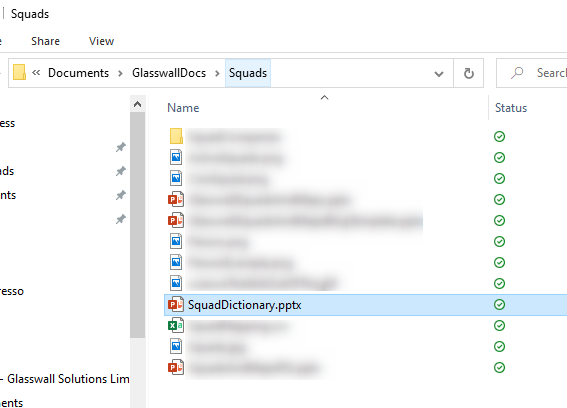
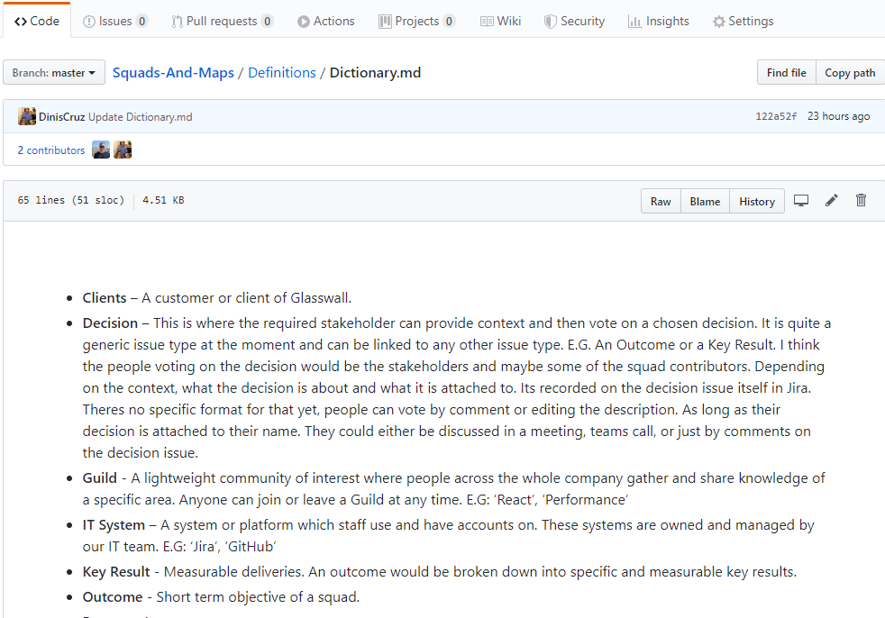

[slideshare - Glasswall 'Squads and Maps - Part 2'](https://www.slideshare.net/LukeRobbertse/glasswall-squads-and-maps-pt2-217174456)

## A Common Language

Use a common language. A necessity for effective collaboration is a common language. Maps allow many people with different aptitudes (e.g. marketing, operations, finance and IT) to work together in order to create a common understanding. Collaboration without a common language is just noise before failure. - Simon Wardley,[swardley](https://medium.com/@swardley)

### Our needs
As our implementation of this framework is in its infancy, teething issues are expected and apparent. One of the bigget initial challenges is being able to answer the wave of questions, and do so in a public, one to many, way. Hence the blogs. [Issue 1](https://medium.com/glasswall-engineering/glasswall-squads-and-maps-issue-1-questions-a5056b8c37c9) was answering some of the initial questions that had been raised. This issue is going o focus on how we address a bulk of questions around the new terminoogy being used in the organisation. As the operational manager of our Squads and Maps framework, alot of these questions are directed at me. It became obvious that there was a need for us to have a dictionary and other ways of creating a common language. A need to remove ambiguity around the understanding of the terms and words used in the world of Squads and Maps.

### Initial attempt
I had initially started coming up with a dictionary on my local machine, defining our terms as I was discussing them more. Then during a meeting somone asked 'What is a Tribe', at which point I refered to my local PPT. It was brought to my attention, that trying to complete this piece of work locally, before sharing it with everyone, is not the most effective. 

:(

### Progress to something better
So I went through activity of creating a repo on Github with a series of MD files which will be used to store our Common Language.
Dictionary of terms, understansing roles and responsibilities, explaining our workflows, desbribing the relation between nodes on our graphs and node mapping on Jira. While I was added I decided to use this as a store for each issue in this series of Blogs.
[Github - Glasswall Sqauds and Maps](https://github.com/filetrust/Squads-And-Maps)

#### Why Github?
- Publically available, open to staff and the rest of the world
- Team memebers can directly contribute, update, improve and help expand it.
- Anyone else can also review and contribute via Issues or Pull Requests.
- Visible history and progression. This journey is ultimately part of our story.

### Reference - wardelymapping

In Simon Wardely's table of doctrine principles he talks about a phase 1 of stopping destructive behaviour.

The first part of this is Communication.
Use a common language (necessary for collaboration)
Challenge assumptions (speak up and question)
Focus on high situational awareness (understand what is being considered)

References:
- https://medium.com/wardleymaps/doctrine-8bb0015688e5
- https://learnwardleymapping.com/home/doctrine/
