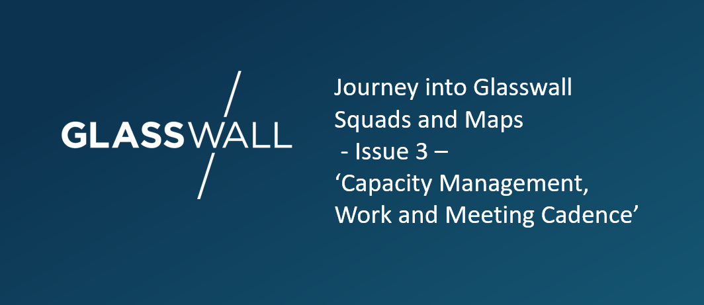
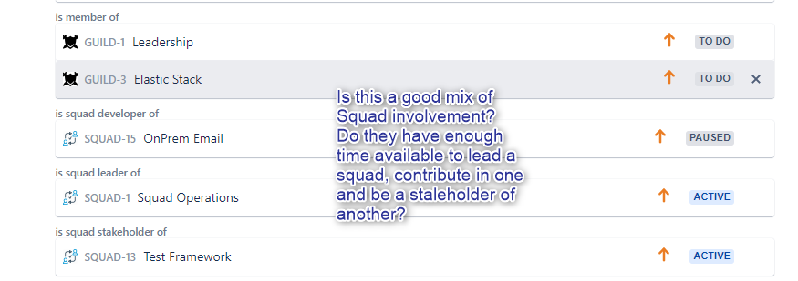
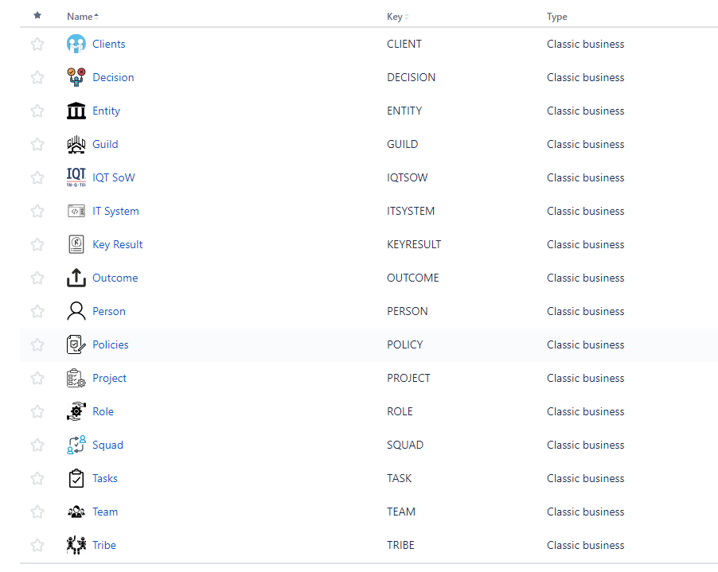

# Title: Capacity Management and Work/Meeting Balance

[slideshare - Glasswall 'Squads and Maps - Part 2'](https://www.slideshare.net/LukeRobbertse/glasswall-squads-and-maps-pt2-217174456)

In this blog we cover two important topics and ones that have been discussed at length these past few weeks.
Both topics are closely related and ultimately tackle the productivity issue presented by distraction and task switching. 

## Capacity Management

Where previously an individual was a member of one team and teams were assigned work, it is clear at a high level what scope of work someone should be focusing their time on. We all know this is not reality but at face value it's simple enough.
The situation now is that individuals can be a part of multiple squads, each squad working on a different outcome. We still have our team structure which aligns with our organisational chart and defines line management structure, very important. But the vehicle for work to be accomplished is in the form of a cross functional squad, and we encourage staff to be involved as many squads as is suitable for them. 
Everyone is different, some might prefer to remain focused on a single squad, where another person might want to spend half the week focused on one squads outcome and half the week on another. We could even have an engineer spending one day a week trying their hand at some design work in a squad delivering to an internal stakeholder and not a client. Either way, a common question has been asked: How do I manage my time commitment across multiple squads?

### A good question indeed and one desperate for an answer and a solution
We iterated over how to deal with this. We tried to come up with a good way for people to manage their own time commits to different squads. We thought of using sub links between our Issues on Jira and see if we could establish an intermediary link between a Person and the Squads they are mapped to, that included a time commitment measured in Hours Per Week. This was not going to work and required too much engineering in Jira. We then attempted using Airtable as a store of everyone's squad commitments and how many hours per week they were committing to each of their squads. This too was not a natural integration and a large amount of technical
resistance was surfacing as we went down this path.

We then realised that we were over thinking things for a potential future problem that we did not yet have. We were 
trying to create a way to specifically track and measure everyone's time and an over engineered approach at that.
We realised the need for a simpler way to address this and put the trust in our people to manage it themselves.

### Proposal

Individual:
- Manage their own time and squad commitments and contributions. 

Squad Leader:
- Negotiates with the individual how much time they will contribute to squad.
- Ensures that their contributors are effectively delivering against their outcomes
- Accountable for having the right roles and time commits in their squad

Line Manager: 
- Responsible for monitoring the health of each person. Not stretched too thin or task switching to much. Has the right amount of squad contributions for the individual
- Squad contributions is aligned to their PDP, etc
- Conflict resolution for squad commitments.
- Review each of your Team Members and make sure they are appropriately mapped.

The power in the above is that we are trusting people to manage their own time without tracking anyone's specific hours. This is a modern workplace and empowering them in this way should be a positive motivational factor. It also emphasises the clear importance of line management in the squad model. Line managers know their people best and part of their roles should be to continuously review the commitments of their direct reports, guiding them to a healthy balance and aligning this to their professional development plan. 

It is the natural blend of the squad leaders accountablity for obtaining the appropriate resource level to achive the outcome(s) of a squad vs the team leaders accountability for the professional development and health of their reports that should maintain the balance.

The squad leader has to be prepared and organised to make the most of the 1 day in a week they might have of a designers time - and this is a key learning exercise to be able to cut wastage and maximise productivity. And also to raise the issue when they feel the contribution of resources is not at a high enough level to make sufficient progress on delivering the outcome. Where the balance cannot be maintained is then a sign of overcommitment and whilst it will be a key feed into furture recruitment plans it also means we have to focus on what gives us the highest value at that time.  
  
 
    
   

## Meetings and Deep work - Finding the balance

Having recently read the book '[Deep Work by Cal Newport](https://www.amazon.co.uk/Deep-Work-Focused-Success-Distracted/dp/0349411905)'
the topic of deep work has been present in my thoughts as has it in other Glasswall staff. We a lot of new initiatives and ideas.
New ways of working, squads and presentations and everything else. A lot of us find that our calendars are booked with meetings pretty 
much all week, leaving very little time for uninterrupted focus. Something which is needed for delivering high quality outputs and 
to come up with most cognitively intensive solutions. How do we fit this in with meetings jotted throughout morning and afternoon five
days a week? We have a problem to solve.

Challenge: Meetings occurring throughout the week can be distracting and prevent deep work and uninterrupted focus on delivering squad outcomes

### Proposed Solution
Have a schedule as we plan which days in the week most meetings will occur and which days we will do a best effort to keep them meeting free. Enabling days of high focus on outcome delivery. 
This was presented to the company this week, it now open for discussion, feedback, challenges and refinement. 
We will look to finalize and make this official in the next few weeks.

### Schedule
Monday: Team meetings. Line management meetings. Squad Leader meeting.

Tuesday and Thursday: Best effort meeting free days with Squad meetings being the exception. Stand ups, design sessions, decision meetings for squad outcomes only.

Wednesday: Morning: Squad Work. 
Afternoon: Training slots, Presentations, All hands meeting.

Friday: Morning: Releases , Round up, Publications.
Afternoon: Hackathons, testing, breaking, security validation. Play with weeks work and raise issues to be addressed the following week.

### Progress

We now have an array of Issue types we can link together as we map our way through Squads.

