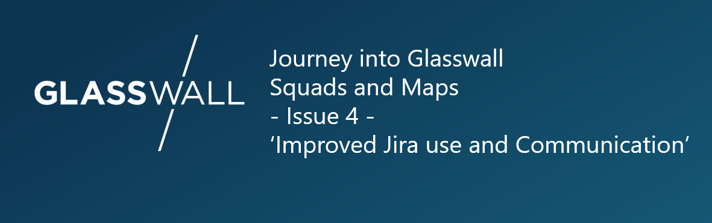
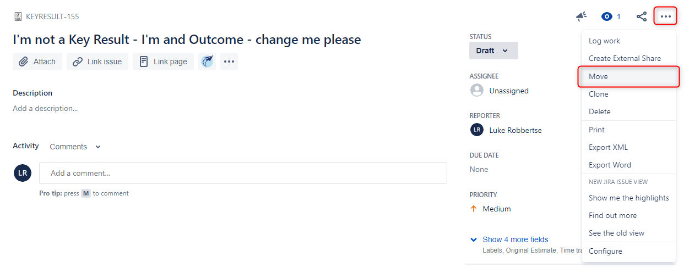
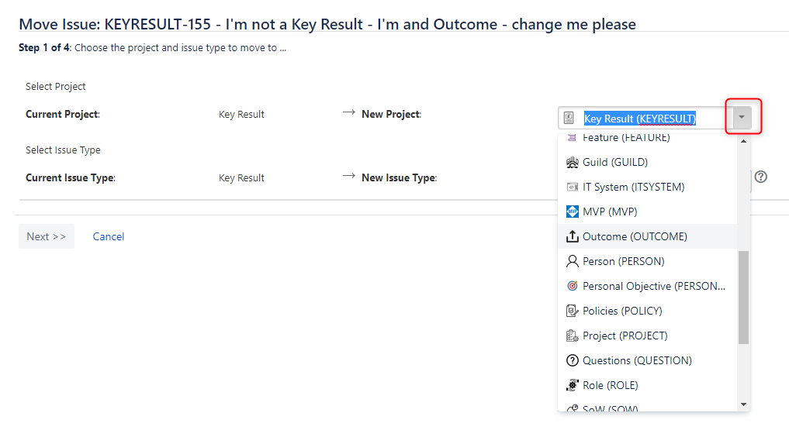
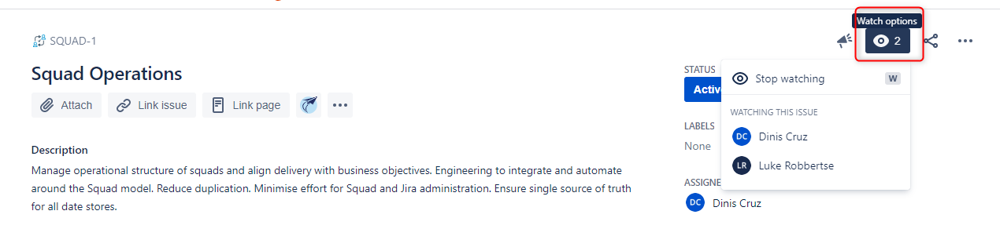
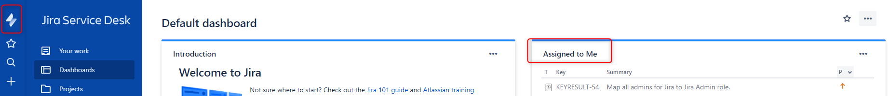
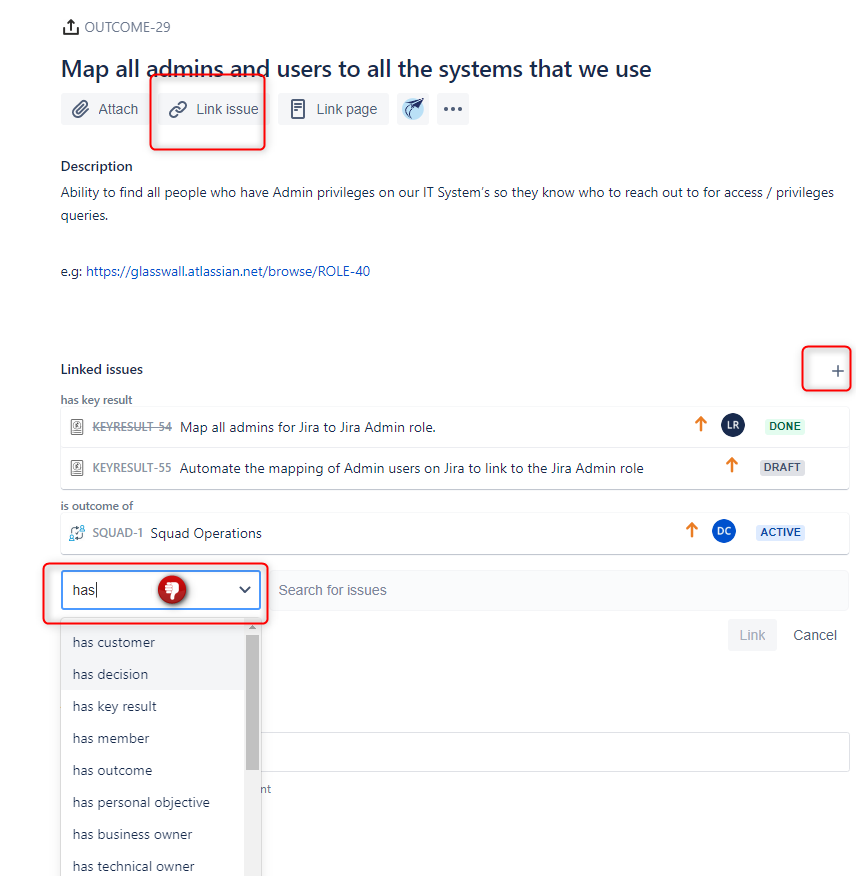
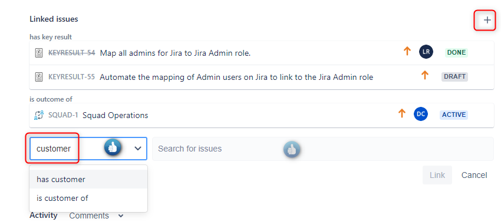

# Title: Jira tips and Squad communications

Today we go over where we communicate about our squad work. A few tips on making better use of Jira. And a naming issue I'd like as much
feedback from everyone on to improve.

## When to communicate on Jira or Slack/Teams

As most of the content for this blog series stem from, it all starts with a question:
'Jira is used to track workflow and Slack to communicate within the various squads. But Jira isn’t really used for communication. Correct? Just want to double-check before I correct someone.'

My reply was then refined and improved by the person who asked the question, thanks Nick, then shared with a wider audience as:

'A bit of guidance from our Squads Grandmaster @Luke Robbertse on when to communicate on Slack versus Jira:
Jira should be used for capturing comms related to a specific squad / outcome or key result. Commenting on Issues in Jira means a conversation is attached to that specific Issue.
Slack is used for general organisation (including setting squad meetings :face_with_raised_eyebrow:), collaboration, discussions and some Q+A. Where there is specific dialogue that adds content and context to a Squad or Outcome, that should be captured as a comment on the Jira Issue.'

## Changing an Issue type on Jira - 'Move'
Challenge: 'I have create a Key Result (Type of issue we have on Jira), but it is not a Key Result and should be an Outcome (another issue type). There is no way to change it so I have to re-create it which is duplicated effort and now we have issues that need deleting.'

Solution: You can infact change an Issue on Jira from one type to another, though doing so is not so obvious to new users. The button that does this is called 'move'.

- Locate the Issue
- Click on the ellipsis and select 'Move'
- Complete the steps

## Watching and Assigning Issues
### Watch
Challenge: 'I don't know when new updates or changes occur to a Squad or to an Ouccome.'  
Solution: 'Click the watch icon on that Issue.'

### Assign
Assigning an issue has been an interesting discussion point. To start this off refer to our [Common Language: Issue-Fields](https://github.com/filetrust/Squads-And-Maps/blob/master/Definitions/Issue-Fields.md)

But some of our resources, mostly ones not in engineering roles, have started using Jira to track their own Tasks. Sometimes a Key Result is not a measurement relating to an Outcome, but somehting that an individual contributor will do and achieve. 
These resoucres would like a single pain of glass to view all 'work' related to them. Wanting to make our model flexible and work for all, I advised that in these situations, assign that Key Result to yourself. Or create Tasks and assign them to yourself. 

You can then navigate to the Jira default dashboard and view all 'work' assigned to yourself.

  
  
## Linking Issues
It has been said that it is difficult to link issues. We intentionally have a large list of Issue Linking available with well thought Inward and Outward descriptions  select  from the list of  and difficult to link issues. A tip is to not start typing the first word in the link description. 'Is' or 'Has'.
But rather type the key word in the description. 'Squad' or 'Role' or 'Customer'. Type in the first box, and the list of options will be reduced to just what is related to that word in the link. 

As an example, I need to add a customer to the below Outcome:

  
  
## More details and links from Squad on Jira
The focal point of our Squads and Maps model are Outcomes. It is important that time spent and work done by anyone in the organisation links to the delivery of an Outcome. Outcomes have Customers and Key Results. They achieve objectives and solve problems. An Outcome however, is the child of a Squad. The Squad is the central point of linking everything together. As such, we encourage more details to be included in the 'Squad' issue on Jira. E.G - A link to the kanban board where the work is being track. A link to the slack channel where the squad communicates. Link to the wiki or documentation being done by that Squad. Link to the source control being used. Jira will not hold all the information, will not be the soure of truth for everything, but is being used to link it all together. And for this to be effective way to map our environment, those links need to be included.

## Guilds - Work or Social?
Question: 'Do Guilds need to be work related or could they be social?'

If we refer back to our Common Language our [definition](https://github.com/filetrust/Squads-And-Maps/blob/master/Definitions/Dictionary.md) of a guild is:
"A lightweight community of interest where people across the whole company gather and share knowledge of a specific area. Anyone can join or leave a Guild at any time. E.G: ‘React’, ‘Performance’"

For me, its a community and its up to members of the community to drive discussions, sharing, lessons learnt, discovery of new tools and techniques. Etc. They can either schedule a monthly meetup, coffee, in or out of office activity. Or push out information on topics when they come across them. Sometimes event driven, but should probably being doing something atleast every month.
Just to reiterate though, Guilds do not do any Glasswall specificwork. They dont work on tasks or outcomes or key results. They just share knowledge, have meaningful discussions, do Q+A sessioons, provide references, share experiences.

Tangent over, back to the question - I think they should definately be work related *and social*! I actually think that a social guild is more likely to get some traction and activity which teach and encourage the work topic related guilds how to operate and be effective. 
The first two prosed social guilds are: 'Tabletop Games' and 'Drinking' :)
  
  
## A new name to replace Squad Developer?
And finally, I would like to open this question up to everyone to feedback and come to the best answer.
We have defined [3 types of contributors to a Squad:](https://github.com/filetrust/Squads-And-Maps/blob/master/Definitions/Squad-Roles-And-Responsibilities.md)
- Squad Leader
- Squad Developer
- Squad Stakeholder

Wihtout the reference, The Squad Developer can be interperted as being somone who writes code. Where in our case its not(some Squad's don't do any engineering work), it is someone who is doing the work to achieve the Key Results and deliver the Outcome. You could be a Squad Developer playing the role of tester, coder, product, sales, support etc. 

I am struggling to think of a better word to desribe these squad members myself, and as such looking forrward to feedback from all!
Squad doer / worker / enginneer / contributor?

