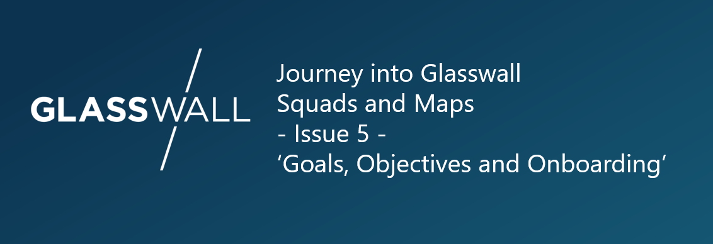

# Title: Personal Objectives, Organisational Goals, Technology Goals. And Onboarding :)

Personal Objectives for our staff and linking them to Organisation Goals and Technology Goals.

## Lets start with who we, Glasswall, are as an Organisation

### Vision
Safety and integrity through trusted files.

### Mission
To become the global leader in the content, disarm and reconstruction segment of cybersecurity.

### Values
#### Integrity
Trust, transparency and honesty are at the heart of who we are and how we behave with our customers and colleagues alike.
#### Collaboration
Our success is predicated on the ability to turn individual talent into collective brilliance. Our desire to work, share, learn and achieve together applies to customers and colleagues alike.
#### Excellence
We share a passion for craftmanship and aim to be the best at what we do, every step of the way.
#### Simplicity
We believe that simplicity should apply across all aspects of our business. We strive to deliver leading solutions that are easy to understand and intuitive to use.

## Goals and Objectives 

### Organisational Goals

Jira Issue

### Technology Goals

Jira Issue 

### Personal Objectives
Jira Issue. Fields

### Lining it all together
Linking it all together

## Onboarding - Tracking this on Jira

Onboarding Squad - Squad Developrs - Outcomes and KRs - Linking peoples effort and time spent on Jira.

   

#### Squads and Maps Publications so far:
[Issue 1 - Questions and Answers](https://medium.com/glasswall-engineering/glasswall-squads-and-maps-issue-1-questions-a5056b8c37c9)  
[Issue 2 - Common Language](https://medium.com/glasswall-engineering/slideshare-glasswall-squads-and-maps-part-2-e3b8b222b72f)  
[Issue 3 - Capacity Management and Work / Meeting Balance](https://medium.com/glasswall-engineering/glasswall-squads-and-maps-issue-3-capacity-management-and-work-meeting-balance-cd7660d15100)  
[Issue 4 - Using Jira tips and Squad communications](https://medium.com/glasswall-engineering/jira-tips-and-squad-communications-2bbc7676aa10)
